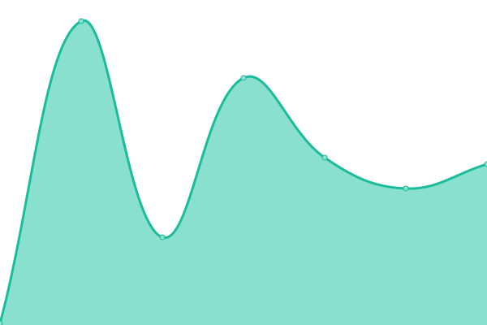

# [📈 Live Status](https://saharshxyz.github.io/uptime): <!--live status--> **🟩 All systems operational**

This repository contains the open-source uptime monitor and status page for [Saharsh Yeruva](https://saharsh.xyz), powered by [Upptime](https://github.com/upptime/upptime).

With [Upptime](https://upptime.js.org), you can get your own unlimited and free uptime monitor and status page, powered entirely by a GitHub repository. We use [Issues](https://github.com/saharshxyz/uptime/issues) as incident reports, [Actions](https://github.com/saharshxyz/uptime/actions) as uptime monitors, and [Pages](https://saharshxyz.github.io/uptime) for the status page.

<!--start: status pages-->
<!-- This summary is generated by Upptime (https://github.com/upptime/upptime) -->
<!-- Do not edit this manually, your changes will be overwritten -->
<!-- prettier-ignore -->
| URL | Status | History | Response Time | Uptime |
| --- | ------ | ------- | ------------- | ------ |
|  [site](https://saharsh.xyz) | 🟩 Up | [site.yml](https://github.com/saharshxyz/uptime/commits/HEAD/history/site.yml) | 

 103ms
     
 | 

<a href="https://uptime.saharsh.xyz/history/site">100.00%</a>
    

|  [v1](https://v1.saharsh.xyz) | 🟩 Up | [v1.yml](https://github.com/saharshxyz/uptime/commits/HEAD/history/v1.yml) | 

 161ms
     
 | 

<a href="https://uptime.saharsh.xyz/history/v1">100.00%</a>
    

|  [analytics](https://analytics.saharsh.xyz) | 🟩 Up | [analytics.yml](https://github.com/saharshxyz/uptime/commits/HEAD/history/analytics.yml) | 

 141ms
     
 | 

<a href="https://uptime.saharsh.xyz/history/analytics">100.00%</a>
    

|  [vc](https://saharsh.vc) | 🟩 Up | [vc.yml](https://github.com/saharshxyz/uptime/commits/HEAD/history/vc.yml) | 

 834ms
     
 | 

<a href="https://uptime.saharsh.xyz/history/vc">100.00%</a>
    

<!--end: status pages-->

[**Visit our status website →**](https://saharshxyz.github.io/uptime)

## 📄 License

- Powered by: [Upptime](https://github.com/upptime/upptime)
- Code: [MIT](./LICENSE) © [Saharsh Yeruva](https://saharsh.xyz)
- Data in the `./history` directory: [Open Database License](https://opendatacommons.org/licenses/odbl/1-0/)
